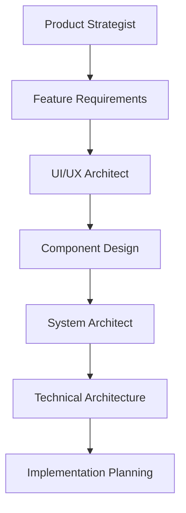
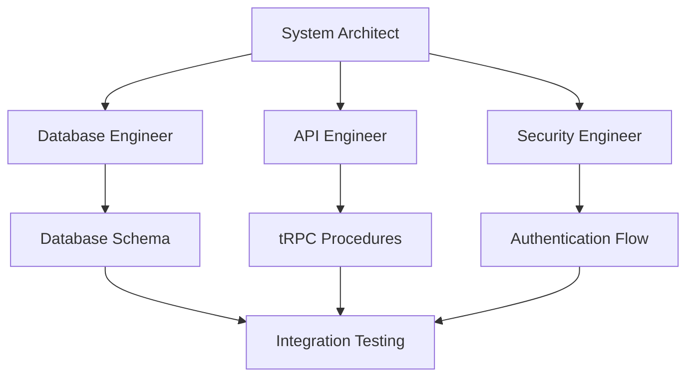
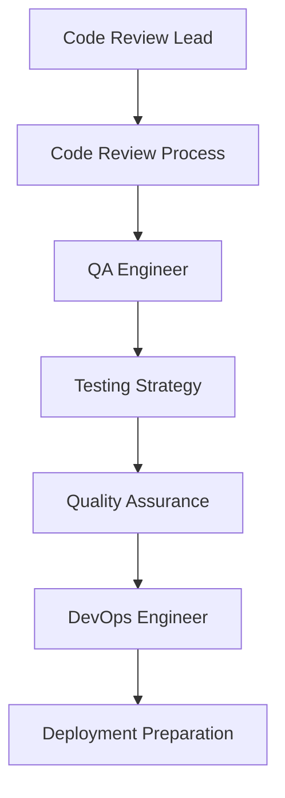

# Dashboard Development Team - Claude Code Configuration

## 🎯 **Overview**

This directory contains a complete strategic team configuration for Claude Code, designed to provide comprehensive development support for the TypeScript dashboard application. The team structure follows real-world development team patterns with clear roles, responsibilities, and collaboration workflows for a modern web application built with SvelteKit, Hono, oRPC, and Drizzle ORM.

## 🎭 **Orchestrator-First Architecture**

This configuration uses an **orchestrator-first approach** where the main Claude Code instance acts as a master coordinator:

### **How It Works**
1. **User** sends request to Claude Code
2. **🔵 Orchestrator** analyzes requirements and context
3. **🔵 Orchestrator** delegates to appropriate specialized agents/skills
4. **Specialized team** implements specific solutions
5. **🔵 Orchestrator** reviews quality and presents results

### **Key Principles**
- **No Direct Implementation**: Main Claude never writes code directly
- **Strategic Coordination**: Always considers big picture and team coordination
- **Quality Assurance**: All work is reviewed and validated
- **Context Management**: Maintains project continuity and strategic alignment

## 🏗️ **Team Structure**

### **Master Coordinator**
- **🔵 Orchestrator** - Master coordinator, context management, team orchestration

### **Layer 1: Strategy & Planning**
- **🟣 Product Strategist** - Feature planning, requirements analysis, user story creation
- **🩷 UI/UX Architect** - Component design, user experience, design system management

### **Layer 2: Design & Architecture**
- **🔴 System Architect** - Technical leadership, cross-system integration, architecture decisions

### **Layer 3: Implementation**
- **🔵 Database Engineer** - Drizzle ORM implementation, SQLite/Turso optimization
- **🟢 API Engineer** - oRPC development, Hono API implementation, type safety
- **🟡 Security Engineer** - Authentication systems, security implementation

### **Layer 4: Quality & Operations**
- **🩵 Code Review Lead** - Code quality standards, review processes
- **🟠 QA Engineer** - Testing strategy, quality assurance
- **🟢 DevOps Engineer** - CI/CD pipelines, deployment, infrastructure

## 📁 **Directory Structure**

```
.claude/
├── agents/                    # Team members (AI agents)
│   ├── product-strategist.md
│   ├── ui-ux-architect.md
│   ├── system-architect.md
│   ├── database-engineer.md
│   ├── api-engineer.md
│   ├── security-engineer.md
│   ├── code-review-lead.md
│   ├── qa-engineer.md
│   └── devops-engineer.md
├── skills/                     # Specialized capabilities
│   ├── feature-planning/       # Strategic planning
│   ├── component-design/       # Svelte component design
│   ├── type-safety/           # TypeScript validation
│   ├── schema-migration/      # Drizzle schema changes
│   ├── security-audit/        # Security validation
│   ├── performance-optimization/ # Performance tuning
│   ├── documentation-generation/ # Documentation
│   ├── testing-strategy/      # Testing frameworks
│   ├── code-review/           # Code quality
│   └── deployment-pipeline/   # CI/CD automation
├── commands/                  # Package-specific commands
│   ├── db.md                  # Database operations
│   ├── auth.md                # Authentication management
│   ├── api.md                 # oRPC/Hono API development
│   ├── web.md                 # SvelteKit frontend development
│   └── orchestrate.md         # Team orchestration
├── hooks/                     # Development workflow hooks
│   ├── pre-commit.md          # Pre-commit automation
│   └── pre-push.md            # Pre-push validation
├── settings.json              # Claude Code configuration
├── settings.local.json        # Local configuration overrides
└── README.md                  # This file
```

## 🚀 **Quick Start**

### **Using the Orchestration System**

This configuration features a **dependency-driven orchestration system** that coordinates the team automatically for complex tasks:

#### **Automatic Triggers**
The orchestrator automatically activates when you:
- Request complex feature implementation (3+ steps)
- Mention multiple domains (database + API + UI + security)
- Ask to "coordinate the team" or "orchrate implementation"
- Use the `/orchestrate` command

#### **Manual Trigger**
```
/orchestrate Add user authentication system with social providers
```

#### **Orchestration Workflow**
1. **Phase 1: Parallel Research** (Product, Security, Documentation, Performance research simultaneously)
2. **Phase 2: Sequential Design** (Database → API → UI design with dependencies)
3. **Phase 3: Smart Implementation** (Database first, then parallel API/UI, then security integration)
4. **Phase 4: Sequential Integration** (System integration → Code review → QA testing → Deployment)

### **Package-Specific Commands**

- `/db` - Database operations, Drizzle migrations, schema management
- `/auth` - Authentication configuration, security setup
- `/api` - oRPC/Hono API development, procedures, documentation
- `/web` - SvelteKit frontend development, components, optimization
- `/orchestrate` - Trigger full team orchestration for complex features

### **Automated Workflows**

- **Pre-commit**: Type checking, linting, basic validation
- **Pre-push**: Full test suite, build validation, performance checks
- **CI/CD**: Comprehensive pipeline with quality gates and deployment

## 🔄 **Complete Development Workflow**

### **Phase 1: Planning & Design**


**Activities:**
1. **Product Strategist** creates user stories and acceptance criteria
2. **UI/UX Architect** designs components and user experience
3. **System Architect** validates technical feasibility and architecture
4. Team reviews and approves implementation plan

### **Phase 2: Implementation**


**Activities:**
1. **Database Engineer** implements Drizzle schema and migrations
2. **API Engineer** develops oRPC procedures and Hono API endpoints
3. **Security Engineer** implements authentication and security features
4. **System Architect** coordinates integration and resolves architectural issues

### **Phase 3: Quality & Review**


**Activities:**
1. **Code Review Lead** manages code reviews and quality standards
2. **QA Engineer** creates and executes testing strategies
3. **DevOps Engineer** prepares deployment pipeline and infrastructure
4. Team collaborates on quality assurance and release readiness

## 🛠️ **Configuration Files**

### **Core Configuration**
- **settings.json** - Main Claude Code configuration with permissions, agent settings, and UI preferences
- **settings.local.json** - Local configuration overrides
- **hooks/** - Automated development workflow hooks for quality assurance and validation

### **Enhanced Orchestration System**
- **agents/orchestrator.md** - Master coordinator with dependency-driven workflow
- **commands/orchestrate.md** - Manual trigger for full team orchestration
- **Complete workflow documentation** integrated into this README

## 🎨 **Agent Color Coding**

- 🟣 **Purple**: Product Strategist (Strategy & Planning)
- 🩷 **Pink**: UI/UX Architect (Design & Experience)
- 🔴 **Red**: System Architect (Technical Leadership)
- 🔵 **Blue**: Database Engineer (Data & Storage)
- 🟢 **Green**: API Engineer (Interfaces & Integration)
- 🟡 **Yellow**: Security Engineer (Security & Protection)
- 🩵 **Cyan**: Code Review Lead (Quality & Standards)
- 🟠 **Orange**: QA Engineer (Testing & Validation)
- 🟢 **Lime**: DevOps Engineer (Deployment & Operations)

## 📊 **Team Benefits**

### **Complete Development Lifecycle**
- From idea to production with full coverage
- Strategic planning to operational excellence
- Quality built-in at every stage

### **Specialized Expertise**
- Each agent has deep domain knowledge
- Clear responsibilities and ownership
- Collaborative decision-making

### **Automation & Efficiency**
- Automated quality checks and validation
- Streamlined development workflows
- Reduced manual effort and human error

### **Quality & Reliability**
- Comprehensive testing and validation
- Security-first approach
- Performance optimization

## 🔧 **Customization**

### **Adding New Agents**
1. Create agent file in `.claude/agents/`
2. Follow the established YAML frontmatter format
3. Define clear expertise and responsibilities
4. Update team workflow documentation

### **Adding New Skills**
1. Create skill directory in `.claude/skills/`
2. Include skill.md and instructions.md files
3. Define clear use cases and integration points
4. Update automation workflows

### **Modifying Workflows**
1. Update hook configurations as needed
2. Modify settings.json for permissions and preferences
3. Update team-workflow.md for process changes
4. Test with sample development scenarios

## 📞 **Support**

For questions about this configuration:
1. Review the agent and skill documentation
2. Check the team workflow documentation
3. Examine the settings and hook configurations
4. Test with specific development scenarios

This configuration provides a comprehensive, professional-grade development team that supports the entire software development lifecycle with specialized expertise and automated workflows.